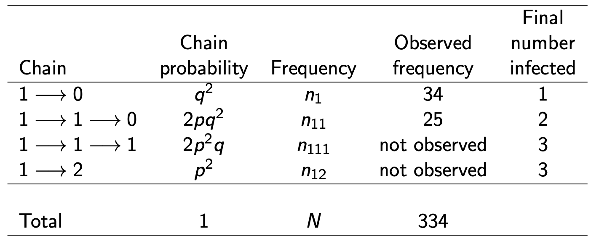

# Introduction
## Notation

- $\theta$ = unobserved vector quantity or pop parameter of interest
- $y$ = observed data
- $\tilde{y} \text{ or } y_{n+1}$ unknown but potentially observable quantities

## Bayesian inference 

- Probability statements conditional on $y$
  - $p(\theta | y)$ or $p(\tilde{y}|y)$
  - Also on known values of any covariates

### Bayes' rule

- To make probability statements about $\theta | y$, start with joing
  probability distribution
  - Can be written as product of two densities that are referred to as the prior
    distribution and the sampling distribution
  - $p(\theta, y) = p(\theta)p(y | \theta)$
- Conditioning on the known value of the data, using Bayes' rule we get the
  posterior density
  - $p(\theta | y) = \frac{p(\theta, y)}{p(y)} = \frac{p(\theta)p(y | \theta)}{p(y)}$
    - Where $p(y) = \sum_\theta p(\theta)p(y | \theta)$
      - Or the integral for continuous $\theta$

- We can generalize this to functions
  - Let
    - $y = (y_1, ..., y_n)$
    - $f(y | \theta)$ be the model for the observed data (usually a probability
      distribution)
    - $\pi (\theta)$ be the prior distribution for $\theta$
  - The posterior distribution for inference on $\theta$:
    - $f(\theta | y) = \frac{f(y | \theta) \pi(\theta)}{\int f(y|u) \pi (u) du}$
      - $\int f(y|u) \pi (u) du$ is the marginal density of the data $y$ and
        doesn't depend on $\theta$!
        - The integral can be very difficult to evaluate
        - When the data is fixed, the integral can be regarded as a normalizing
          constant.

### MCMC Methods

- MCMC allows us to avoid evaluating the integral (marginal density)
- Makes use of the unnormalized posterior density
  - $f(\theta | y) \propto f(y | \theta) \pi(\theta)$
- We can rewrite this in terms of the likelihood function
  - $f(\theta | y) \propto \mathcal{L}(\theta) \pi(\theta)$

- MCMC allows for easier evaluation of the likelihood when you have unobserved
  data 
  - Augments the data to make estimation simpler

## Motivating example 

### Chain Binomial 

- Assume we have a Reed-Frost chain binomial model
  - Independent households where there is a single index case in each household
  - Infections occur within households in discrete time
  - $p$ is the probability an infective infects a susceptible in a household and
    $q = 1-p$ is the chance of escaping infection
  - N = 334 families with 3 susceptibles at the beginning
  - Actual chains are not observed
    - Just how many are infected at end of epidemic
      - $1 \to 1 \to 1$ and $1 \to 2$ chain frequency can't be observed!

- MCMC can augment the data to help infer $p$

### SIR model

- Initially $(S(0), I(0), R(0) = (N-1, 1, 0))$
- Time infectious: $T_I \sim (exp(\gamma))$
- Infectious contacts occur according to Poisson process of rate $\beta /N$
- Therefore the hazard (Force of Infection) is $\frac{\beta I(t)}{N}$
- Infection times are not observed therefore estimating parameters difficult
  - Treated as latent variables
  - MCMC augments time to estimate parameters

## Prior distributions
### Conjugate prior distributions

- Conjugacy
  - Property that the poster distribution follows the same parametric form as
    the prior distribution
  - Conjugate prior distributions along with appropriate sampling distribution
    for the data have the same distribution as the posterior distribution
- Beta prior distribution is conjugate family for binomial likelihood
  - Posterior distribution is Beta
- Gamm prior distribution is conjugate family for Poisson likelihood
  - Posterior distribution is Gamma

- Advantage: 
  - Computational convenience
  - Can be interpreted as additional data
- Disadvantage:
  - Constrain the form of the prior distribution

- Nonconjugate prior distributions:
  - Used when prior knowledge about the distribution of the parameters of
    interest don't correspond to the conjugate prior distribution
  - Computationally more demanding
- Noninformative prior distributions:
  - AKA flat priors
  - Carry little population information
  - Supposed to play a minimal role in the posterior distribution

# Transmission probability
## Data and sampling distribution

- Let's start with a goal of doing inference on the posterior distribution of
  the transmission probability

- $n$ people exposed once to infection
  - $y$ infected
  - $p$ = transmission probability
  - $q = 1-p$

- Binomial sampling distribution:
  $$
  \begin{aligned}
  \mathcal{L}(y|p) &= \text{Binomial}(y|n, p) \\
  &= \binom{n}{y}p^y (1-p)^{n-y} \\
  &= \binom{n}{y}p^y q^{n-y}
  \end{aligned}
  $$

- Given we have a Binomial distribution, we will specify a Beta prior
  distribution for $p$

$$
\begin{aligned}
    p &\sim \text{Beta}(\alpha, \beta) \\
    \pi (p) &= \text{Beta}(p|\alpha, \beta) \\
    \text{Beta}(p|\alpha, \beta) &= \frac{\Gamma (\alpha + \beta)}{\Gamma
    (\alpha) \Gamma (\beta)}p^{\alpha -1} (1-p)^{\beta - 1}, \alpha > 0, \beta >
    0 \\
    \therefore \\
    \text{Beta} &\propto p^{\alpha -1} (1-p)^{\beta - 1} \\\\\\
    \text{Mean: } E(p|\alpha, \beta) &= \frac{\alpha}{\alpha + \beta} \\
    \text{Variance: } \frac{\alpha \beta}{(\alpha + \beta)^2 (\alpha + \beta +
    1)} &= \frac{E(p|\alpha, \beta)[1-E(p|\alpha, \beta)]}{\alpha + \beta + 1}

\end{aligned}
$$

- $\alpha > 0, \beta >0$ indicate "prior sample sizes"
- **Note:** $\text{Beta} \propto p^{\alpha - 1}(1-p)^{\beta - 1}$ looks like a
  binomial distribution!

## Posterior Distribution
### $p$

The posterior distribution of the transmission probability
$$
\begin{aligned}
    f(p|y) &\propto \overbrace{p^y (1-p)^{n-y}}^{\text{likelihood}}
    \overbrace{p^{\alpha - 1}(1-p)^{\beta - 1}}^{\text{prior}} \\
    &= p^{y+ \alpha -1}(1-p)^{n - y + \beta -1} \\
    &\propto \text{Beta}(p| \alpha + y, \beta + n - y)
\end{aligned}
$$

- Posterior probability of transmission for a future draw from the population
  - The posterior mean always lies between the prior mean and the sample mean!
  
$$
\begin{aligned}
    E(p|y) &= \frac{\alpha + y}{\alpha + \beta + n} \\ 
    \text{var}(p|y) &= \frac{E(p|y)[1-E(p|y)]}{\alpha + \beta + n + 1}
\end{aligned}
$$

### Uniform prior distribution

- $[0, 1]$ corresponds to $\alpha = 1, \beta  = 1$
  - Essentially no prior on $p$

$$
f(p|y) = \text{Beta}(p|y + 1, n - y + 1)
$$

## Prediction

- Posterior prediction distribution
  - Posterior because conditional on $y$
  - Predictive because prediction for an observable $y_{n+1}$

$$
\begin{aligned}
    f(y_{n+1}|y) &= \int f(y_{n+1}, p|y) dp \\
    &= \int f(y_{n+1} | p, y) f(p | y)dp \\
    &= \int f(y_{n+1} | p) f(p |y)dp
\end{aligned}
$$

- We can go from line 2 to 3 because $y$ and $y_{n+1}$ are conditionally
  independent given $p$ in the model

# Intro Practical in R

# Simple Gibbs sampler
## Chain binomial model 

- Let's go back to the chain binomial example from the motivating examples
  section

- The multinomial complete data likelihood for $q$ (the probability of failure) is:

$$
\begin{aligned}
  f(n_1, n_{11}, N_3, n_{111} | q) &= \binom{334}{n_1, n_{11}, n_{111}, N_3 -
  n_{111}} (q^2)^{n_1}(2q^2p)^{n_{11}}(2qp^2)^{n_{111}}(p^2)^{N_3 - n_{111}}\\
  \text{where: } N_3 &= n_{111} + n_{12} \\
  &= 275
\end{aligned}
$$

- We do not observe either $n_{111}$ or $n_{12}$, just their total $N_3$

- The Gibbs sampler iteratively samples the model unknowns from a sequence of
  full conditional distributions
- To sample one draw from each full conditional distribution at each iteration,
  it assumes that all other model quantities are known at that iteration
- The Gibbs sampler converges to the posterior distribution of the model
  unknowns 
- Here, $n_{111}$ should be augmented, and the posterior distribution of $q$
  estimated.

- The joint distribution of the observations and the model unknowns is:

$$
f(n_1, n_{11}, N_3, n_{111}, q) = \underbrace{f(n_1, n_{11}, N_3, n_{111} |
q)}_{\text{complete data likelihood}} \times \underbrace{f(q)}_{\text{prior}}
$$

- We want to make inference about the joint distribution of the model unknowns
  - $f(n_{111}, q | n_1, n_{11}, N_3)$
  - Possible by using the Gibbs sampler to sample from the full conditionals
    - $f(q | n_1, n_{11}, N_3, n_{111})$
    - $f(n_{111}| n_1, n_{11}, N_3, q)$

### Process

- Start with initial values for unknowns
- For $t=1 \to M$:
  - Sample $q^{(t+1)} \sim f(q | n_1, n_{11}, N_3, n_{111}^{(t)})$
  - Sample $n_{111}^{(t+1)} \sim f(q | n_1, n_{11}, N_3, q^{(t+1)})$

## Full conditionals

- Getting the full conditionals is the tricky bit, but we can calculate if we
  assume the other unknown value are actually known

### $n_{111}$

- Assume $q$ is known
- The conditional probability for the chain $1 \to 1 \to 1$

$$
\begin{aligned}
  \Pr(1 \to 1 \to 1 | N=3, q) &= \frac{\Pr(N=3, 1 \to 1 \to 1 | q)}{\Pr (N=3 |
  q)} \\
  &= \frac{\Pr(N=3| 1 \to 1 \to 1, q)\Pr(1 \to 1 \to 1 | q)}{\Pr(N=3 | 1 \to 1
  \to 1, q)\Pr(1 \to 1 \to 1 | q) + \Pr(N=3 |1 \to 2, q)\Pr(1 \to 2 | q)} \\
  &= \frac{2p^2 q}{2p^2 q + p^2} \\
  &= \frac{2q}{2q + 1}, (0 \le q \le 1) \\
  &\therefore \\
  \text{full conditional } &\text{distribution of } n_{111}: \\
  n_{111} | (n_1, n_{11}, N_3, q) &\sim \text{Binomial}\left(275,
  \frac{2q}{2q+1}\right)
\end{aligned}
$$

### $q$

- Assume $n_{111}$ is known
- Assume a Beta prior distribution for $q$
  - $q \sim \text{Beta}(\alpha, \beta)$
  - $f(q) \equiv f(q|\alpha, \beta) \propto q^{\alpha  - 1}(1-q)^{\beta - 1}$

- The full conditional distribution of $q$:

$$
\begin{aligned}
  f(q | n_1, n_{11}, N_3, n_{111}, \alpha, \beta) &\propto f(n_1, n_{11}, N_3,
  n_{111} | q, \alpha, \beta) f( q | \alpha, \beta) \\
  &\propto \underbrace{q^{2n_1 + 2n_{11} + n_{111}}p^{n_{11} +
  2N_3}}_{\text{complete data likelihood}} \times
  \underbrace{q^{\alpha-1}(1-q)^{\beta -1}}_{prior} \\\\
  q|\text{complete data}, \alpha, \beta &\sim \text{Beta}(2n_1 +2n_{11} +
  n_{111} + \alpha, n_{11} + 2N_3 + \beta)
\end{aligned}
$$

- If we set $\alpha = \beta = 1$, we have a uniform prior on $q$
- A natural point estimate would be the mean of the Beta distribution
  - $\frac{2n_1 +2n_{11} + n_{111} + \alpha}{2n_1 +3n_{11} + 3n_{111} + 2n_{12}+ \alpha + \beta}$
  - Proportion of "escapes" from all exposures

## Sampling with the Gibbs sampler

Now we have the full conditionals, we can update our process from earlier:

- Start with initial values for unknowns
- For $t=1 \to M$:
  - Sample $q^{(t+1)} \sim \text{Beta}(2n_1 +2n_{11} + n_{111}^{(t)} + \alpha, n_{11} + 2N_3 + \beta)$
  - Sample $n_{111}^{(t+1)} \sim \text{Binomial}\left(275, \frac{2q^{(t+1)}}{2q^{(t+1)}+1}\right)$
- Get summaries of the marginal posterior distributions