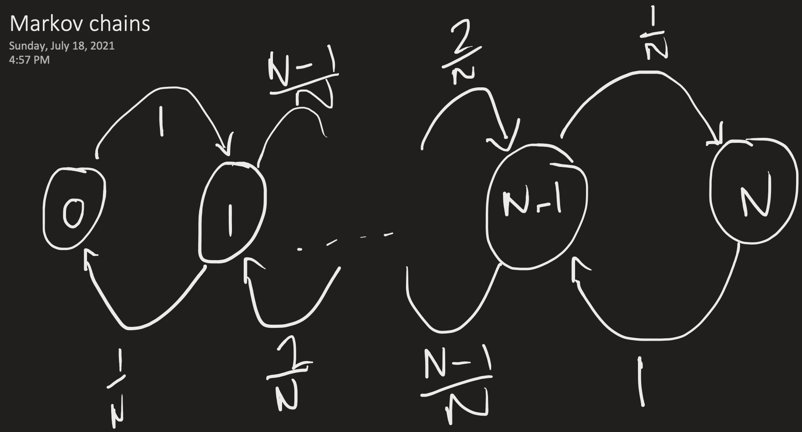

# Importance sampling

-   Sometimes classical MC is impossible because we can't sample from the target
    distribution $p(x)$
-   Instead, we sample from a simpler distribution $q(x)$, the instrument
    density, which now becomes the target distribution

$$
\begin{aligned}
E_p[f(X)] &= \int f(x)p(x) dx \\
&= \int f(x)\frac{p(x)q(x)}{q(x)} dx \\
&= \int z(x)q(x)dx \\
&= E_q[z(x)] \\
&\approx \frac{1}{n} \sum_{i=1}^n z(x_i) \quad \text{By LLN} \\
\text{where: } x_1, ..., x_n &\overset{i.i.d}{\sim} q(x) \\
&\approx \frac{1}{n} \sum_{i=1}^n f(x_i) \underbrace{\frac{p(x_i)}{q(x_i)}}_{W_i = \text{Weights, or}\\
\text{likelihood ratio!}} \\
&\approx \frac{\sum_{i=1}^n f(x_i) \frac{p(x_i)}{g(x_i)}}{\sum_{i=1}^n \frac{p(x_i)}{g(x_i)}}
\end{aligned}
$$

-   The last equation is required when we don't know the normalizing contact of
    $p(x)$!
-   Importance sampling also helps us to decrease the MC error (a problem listed
    above)!

## Elementary Markov chain theory

-   A series of random variables $X_t$ is a stochastic process

-   Markov property:

    -   $\Pr (X_{n+1} = j | X_n = i, ..., X_0) = \Pr (X_{n+1} = j | X_n = i)$

-   One-step transition probability:

    -   $p_{ij}=\Pr(X_1 = j|X_0 = i) \quad \sum_j p_{ij}, p_{ij} \ge \text{ for all } i,j$

-   $X_n$ is a homogenous Markov chain if the transition probabilities are the
    same for all transitions

    -   Inhomogenous otherwise

-   Collect the into a **transition probability matrix**
    $\mathbf{P}^{(n)} = \{p_{ij}^{(n)}\}$ where $(n)$ refers to the number of
    steps in the transition

    -   $\mathbf{P}^{(n)} = \mathbf{P}^n$ i.e. $n$-step transition probabilities
        can be obtained by repeatedly multiplying the transition probability
        matrix by itself

-   A Markov chain is fully specified by its transition probability matrix
    $\mathbf{P}^{(n)}$ and its initial distribution $\mathbf{\nu}^{(n)}$

    -   $\mathbf{\nu}^{(n)} = \mathbf{\nu P}^n$ given
        $\mathbf{\nu}^{(n)}=\nu_1^{(n)}, ..., \nu_s^{(n)}$ where
        $\nu_i^{(n)} = \Pr(X_n = i)$

    -   Allows the marginal distribution of $X_n$ to be easily computed

-   In a discrete distribution, the time spent in each state is distributed
    according to a Geometric distribution as it's the time until the move to the
    next (the first event)

    -   In a continuous distribution, the geometric distribution becomes an
        exponential distribution

### Behavior of Markov chains

-   Irreducible

    -   If you can for from anywhere to anywhere in a finite number of steps
        with a non-0 probability

        -   $p_{ij}^{(n)}>0$ where $n>0$

        -   I.e. the graph is connected so can't get stuck in a state

-   Stationary distribution and long term behavior

    -   If we have a special vector of probability distributions $\mathbf{\pi}$
        (usually defined as a column vector that is then *transposed* for the
        matrix multiplication) on state space $E$ that satisfies
        $\mathbf{\pi}^T = \mathbf{\pi}^T \mathbf{P}$ (**global balance**), it is
        called a stationary (or **equilibrium**) distribution of the
        corresponding homogeneous Markov chain

        -   What this means is that at each time step, the probability
            distributions at each value of the state space
            ($\mathbf{\pi_1}, ..., \mathbf{\pi_n}$) are the same as the previous
            time step!

            -   Doesn't mean that underlying observations don't change, just the
                overall distribution at the value of the state space

        -   Means that the Markov chain becomes very predictable

    -   Hard to solve $\mathbf{\pi}$ unless in a small finite state space

-   Reversible Markov chain - detailed balance equations

    -   $\pi_ip_{ij} = \pi_j p_{ji} \quad \text{for all } i, j$ then
        $\mathbf{\pi}$ is a stationary distribution (detailed balance equation)

        -    Balance preserved between all pairs (**global balance**)

    -   When this condition is met, they are often called **reversible Markov
        chains**

-   Using the lab example of the Ehrenfest diffusion model, we see the following
    transition probabilities, and how we end up in a stationary distribution

{width="483"}
