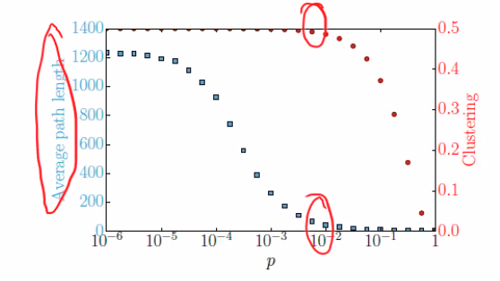
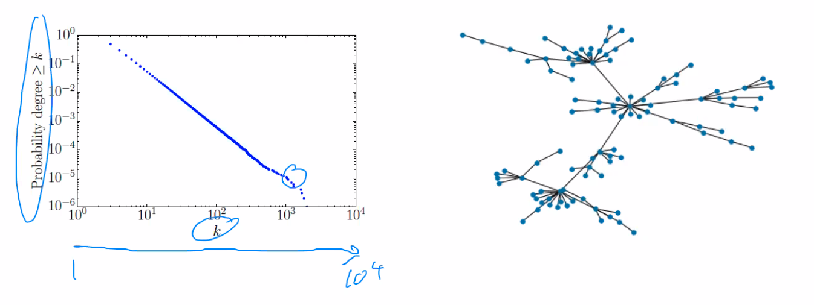
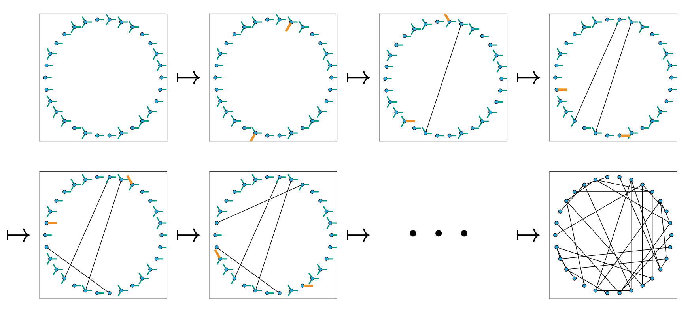

# Network properties

- High degree nodes tend to get earlier in the epidemic and help causes spikes
  - Helps an epidemic take off

- Clustering/transitivity
  - Density of triangles
  - High transitivity
    - More short cycles than you'd expect at random
  - Clustering tends to slow down transmission
    - One of the partners has already been infected
    - Less of a role in the final size of the epidemic
  - Can affect the probability of cases
    - Tends not to influence the probability of an epidemic, but more effects
      the early growth
    - Probability $p$ of transmission has to be quite high for it to be
      'discovered' that there's a triangle i.e. infections transmit along all 3
      edges to get back to the beginning
      - Approximately $p^3$
      - If there is generally small degree, transitivity becomes more important

# Random networks

- Usually have measurements on a few important features that we want to use to
  generate a random network from
  - If the relevant features, simulated network will reproduce important
    dynamics of the real network
- Useful if analytically tractable i.e. can be written down mathematically

- Common random network models
  - Erdos-Renyi networks
    - Analytically tractable for large $N$
  - Small world networks
  - Barabasi-Albert
  - Configuration model
  - Exponential Random Graph Model (ERGM)
    - Analytically tractable for large $N$

## Erdos-Renyi

- Simple random network
- $N$ nodes
- Each pair has edge with probability $p$
  - $p \approx \text{degree}/N$
- Also known as $\mathcal{G}_{n,p}(N, p)$
- Normally associated with typical SIR models i.e.
$$
\frac{dS}{dt} = \frac{\beta I}{N} S
$$

## Small world

- Take $N$ nodes in a ring and connect to nearest $k$ nodes
- Rewire with fraction $p$ with 'shortcuts'
  - Smaller cycles slow down progression
  - If $p$ is very large, your end up with a lot of shortcuts and disease
    spreads similarly to Erdos-Renyi network
  - Moderate $p$ has short typical path lengths and high clustering
    - 

## Barabasi-Albert

- Scale free (power law) network
- Start with $m+1$ nodes all connected to each other
- Add node connecting it to $m$ previously existing node
  - Previously existing selected node is selected proportional to their degree
    - Individuals with high degree are more likely to be selected
- Stop when $n$ nodes
  

- End up with a few key nodes that tend to get infected and then spread
  infections out to rest of network

## Configuration model

- Generate a network and assign a degree distribution
  - E.g. half have degree 3, and other half degree 1
- Choose nodes at random and connect them
  - Each node can only have the number of edges as the number of 'stubs'
    assigned to them at the beginning

- Has the odd property that a selected nodes has lower degree than the
  average degree of the connected nodes
  - $P_n(k) = kP(k)/\langle K \rangle$
  - More likely to have selected your friend because their friendly!
  - Weighting by $k$

## ERGM

- Given vector of parameters $\theta$ and statistical measurement $s$ on a graph
  $G$, choose $G$ with probability proportional to
  $\exp(\theta \cdot s)$
- Generally the network is chosen through MCMC
- Very computationally demanding, so limits network size
- In addition to specifying structural components like the other networks, you
  can specify the covariate structure of the network

# Lab Discussion

## What's the intuition between degree, clustering and betweenness?

- Degree and betweenness are both centrality measures
  - How important are the nodes
    - e.g. someone has large number of contacts therefore could drive
      superspreading event
- Can have low degree and high betweenness
  - 2 clusters that are connected by a single node 
    - Low degree (2), but high betweenness as to get from one cluster to another
      you have to pass through the bridging node
- Clustering and transitivity are related
  - Different ways/scales that it's useful to think about how 'clumpy' a network
    is
  - Two "communities" would be called **modules**
    - The degree/betweenness example above 
  - When communities are not connected together, we'd call them components
    - Can go from any node to any other node *within* a component, but not between
  - **Clicks** are where every node is connected to all the other nodes in a
    small cluster (e.g., everyone in a household is connected), but they don't
    have to have the same external connections