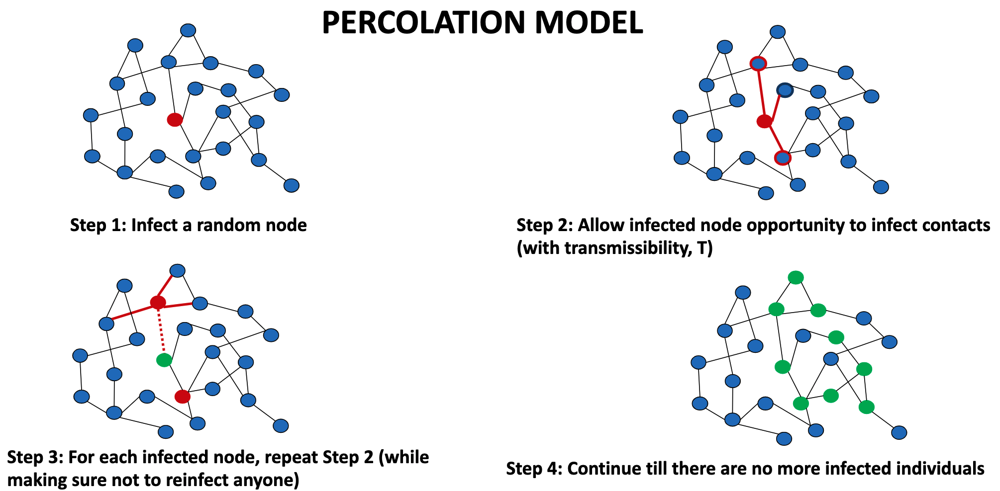
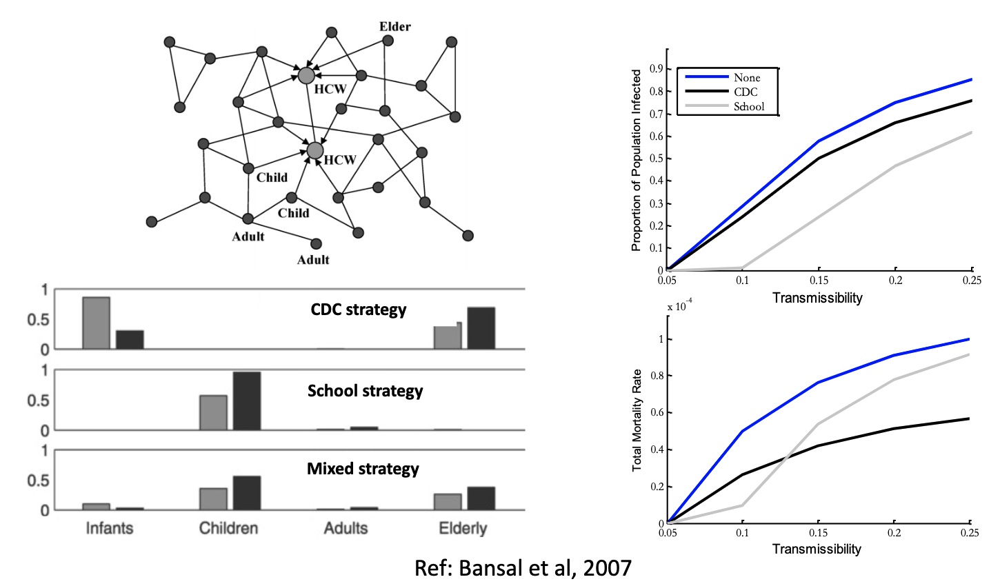
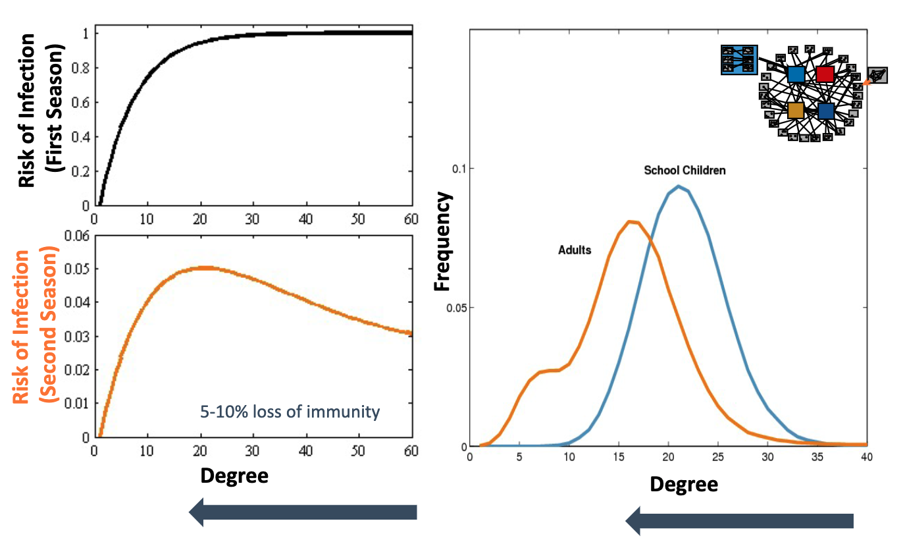
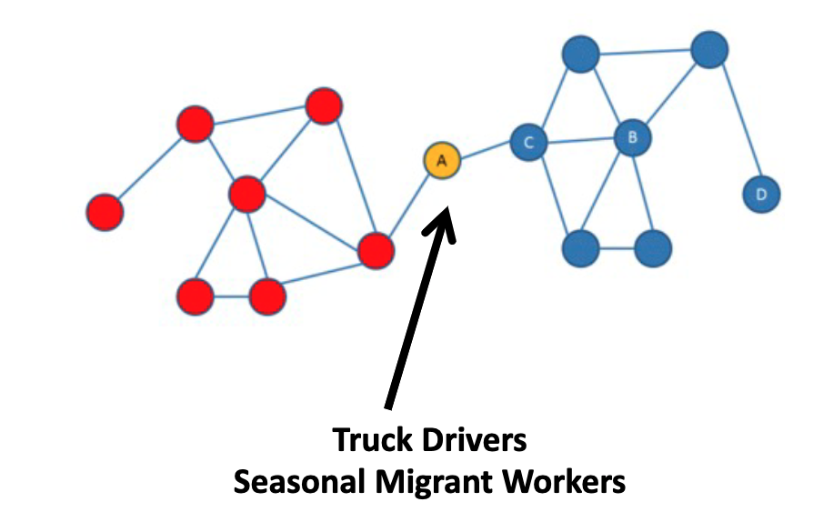
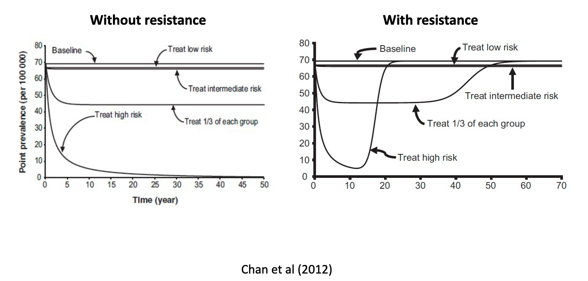
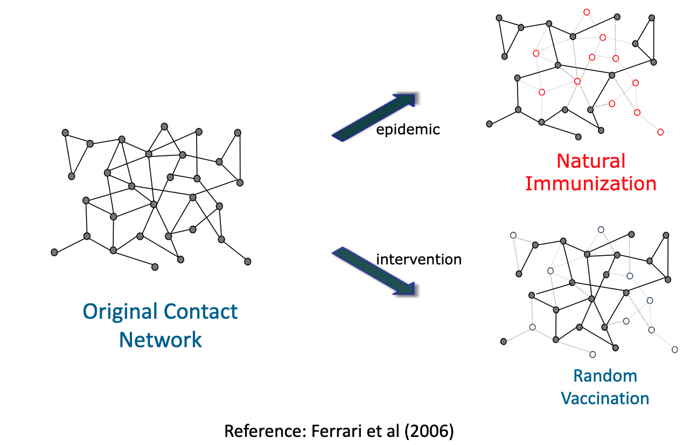
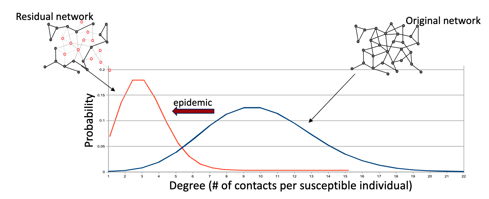

# Review: building contact networks
## Describing the pathogen

- Transmissibility:
  - per contact probability of transmission between an infected and susceptible
    individual within the infected's infectious period

- Percolation model:
  - Allows us to quantify both proportion of pop infected in large epidemic, and
    size of small outbreaks (when transmissibility is very small < 0.05)

# Designing control strategies
## $R_0$

- Depends on both pathogen and host characteristics
  - E.g. Transmissibility **and** average excess degree
- Network models allow you to directly estimate $R_0$
  - Patient 0 is not where we measure $R_0$
    - Not necessarily representative of the population in general
      - Usually consider individuals primary cases (those infected from P0) to
        be representative therefore calculate $R_0$ with them
      - We are randomly selecting P0 therefore might not be a high degree
        individuals, who we expect that would be drivers of early transmission,
        therefore $R_0$ can increase if we calculate it off P0, not those who
        are infected by $R_0$
  
## Assessing control strategies
### Transmission reducing interventions
  
- Reducing $T$ on some or all edges to lower $R_0$

### Contact reducing interventions

- Reducing number of edges
  - E.g. quarantining an infected
- Increases the epidemic threshold
- Lower $R_0$ by lowering network connectivity

### Immunizing

- Removing nodes and their edges
  - Though still want to count total size
  - Same as keeping nodes and edges and setting transmissibility for those
    individuals to 0, just less complex
- Need to determine who to vaccine for maximum benefit
  - When variability in transmissibility, often more prudent to vaccinate the
    vulnerable as lower incidence doesn't always lead to lower mortality when
    transmissibility is high (see influenza modelling below)

# Case studies
## High degree for control

- Need to find proxies for high degree
  - Don't often have complete contact data for a population
  - Age
    - School age children typically highest
  - Social role
    - In animal populations found to be good proxy
    - More dominant in social circle = more likely to have high degree
  - Activity
    - E.g. regions with high trading activities have high degree

- Complexity to targeting high degree individuals
  - Can change over time, e.g.:
    - In 1st wave, everyone S so risk of infection increases with degree
    - In later waves, high degree individuals are most likely to have already
      been infection therefore have some levels of immunity, so now the
      moderate degree individuals now have the highest risk of infection

## Contact tracing

- Helps to identify network structure
- Especially useful for asymptomatic infection
- Efficiency scales with $R_0$ in most cases

## Network connectedness

- Highlight and target betweenness
  - High risk as many paths between modules have to pass through low numbers of
    individuals.

## Modular structure

- Think about metapopulation contact networks
  - Partition into communities
  - Which communities are more closely connected to themselves than to other
    communities
  - Identify high betweenness and where movement restrictions could happen

## Degree assortativity

- Core group = high degree and degree assortativity
  - High degree nodes are more likely to be connected to other high degree nodes
- Sometimes treating core group can backfire e.g. AMR
  - More likely to spread resistance to other groups!

# Pathogen mediated changes
## Network dynamics

- Have dynamics on the network and dynamics of the network
  - Percolation captures 1st

### Events that lead to changes in the network

- Public health intervention:
  - Vaccination
    - node removal
  - School closure, avoidance behaviour
    - Edge reduction

- Social events:
  - Birth/deaths
    - Node addition/deletion
  - Seasonality
    - Edge reduction/increase
  - Migration/social changes
    - Edge rewiring

- Pathogen mediated events:
  - Reduced interaction due to symptoms
    - Edge reduction
  - Immunity
    - Node removal

### Evolution of contact structure

- Difference between network structures when looking at natural immunization vs
  vaccinations, both with remove nodes
  - Higher degree individuals infected, so will be removed
  - Random vaccination doesn't necessarily remove high degree nodes

- Residual graph:
  - Sparser (smaller mean) and more homogeneous (smaller variance)

