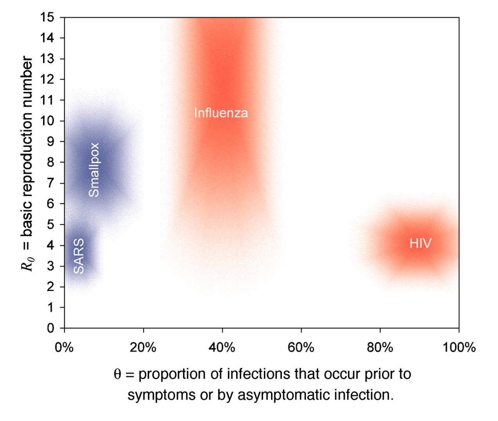
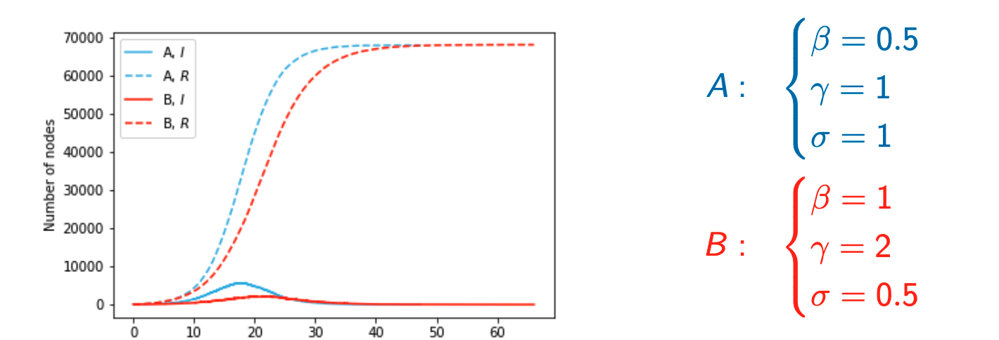
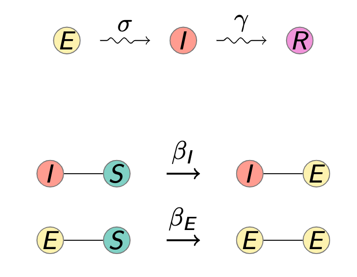
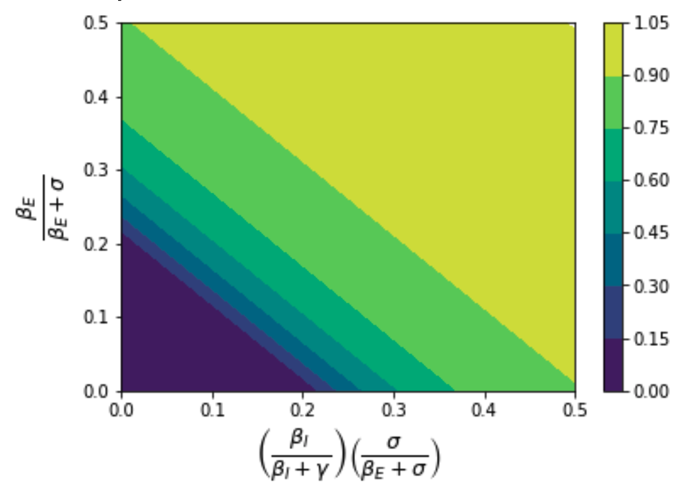
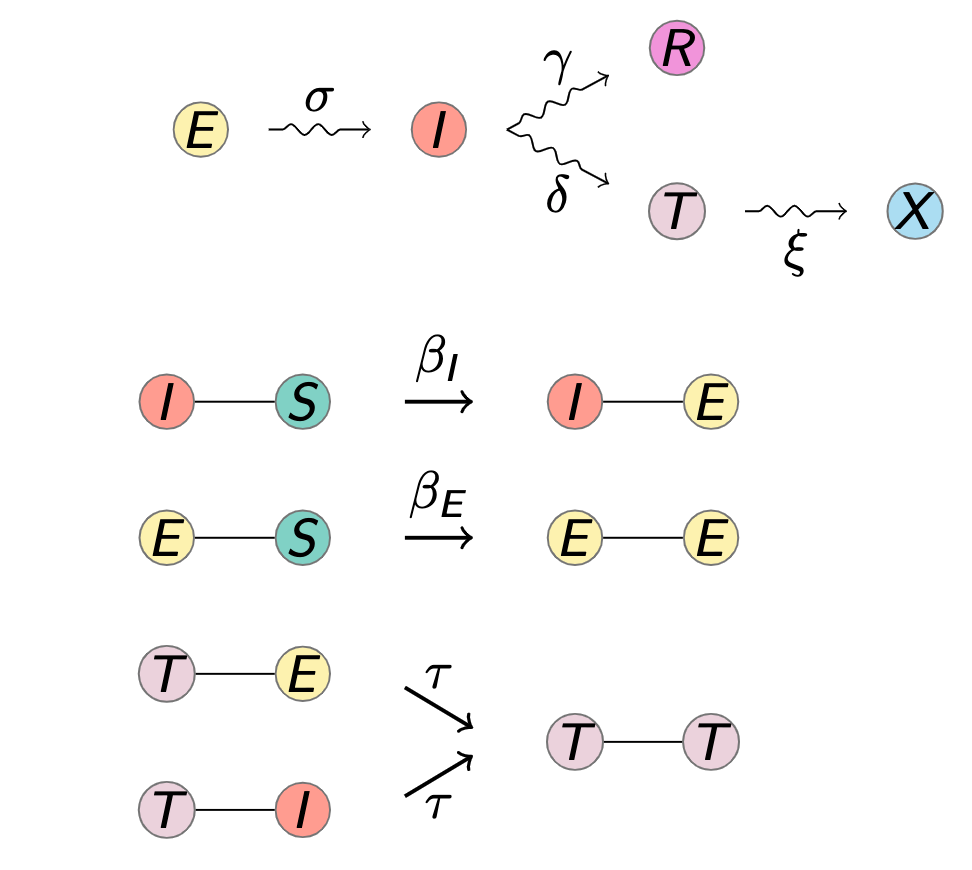
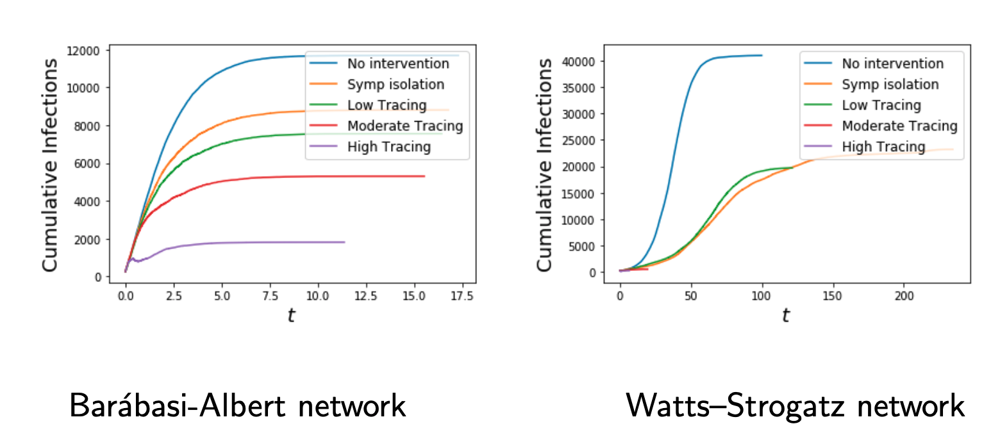

# Contact tracing

- Asymptomatic/pre-symptomatic transmission makes contact tracing more important

## SEIR model

- E state can be non-infectious or infectious (pre-symptomatic)
- 2 types of transitions to consider
  - Due to internal effects $E \to I$, and $I \to R$
  - Due to interactions with neighbors $(I, S) \to (I, E)$

### Configuration network
#### No Presymptomatic transmission

- Random node has degree $k$ with probability $P(k)$, then a random neighbor has
  degree $k$ with probability
  - $P_n(k) = \frac{kP(k)}{\langle K \rangle}$
- Early in the epidemic, the probability an infected node has degree $k$ is $P_n(k)$
- The infected node has $k-1$ susceptible partners (**excess degree**)
  - Early in the epidemic
  - $-1$ because 1 neighbor infected the node initially
- Given an $I-S$ edge, the probability of transmission before recovery is
  - $\frac{\beta}{\beta + \gamma}$
- The expected number of transmissions is

$$
\begin{aligned}
  R_0 &= \frac{\beta}{\beta + \gamma} \sum_k P_n(k)(k-1) \\
  &= \frac{\beta}{\beta + \gamma} \sum \frac{kP(k)(k-1)}{\langle K \rangle} \\
  &= \frac{\beta}{\beta + \gamma} \frac{\langle K^2 - K \rangle}{\langle K \rangle}

\end{aligned}
$$

- Note:
  - This only holds when E is not infectious
  - $\langle K \rangle$ means the average degree
- This is a generalized form of the usual equation for $R_0$
  - $R_0 = \frac{\beta}{\gamma}$

$$

$$

- For configuration network, the final size only depends on:
  - Degree distribution
  - Probability of transmission

#### With Presymptomatic transmission

- Probability of a node entering $E$ before entering $I$
  - $\frac{\beta_E}{\beta_E + \sigma}$
- Probability of node enters $E$, leave $E$ stage having not transmitted, and
  then transmits during the $I$ class
  - $\frac{\beta_I}{\beta_I + \gamma} \cdot \frac{\sigma}{\beta_E + \sigma}$
- We can get $R_0$ from these transitions

$$
\begin{aligned}
  R_0 = \underbrace{\left(\overbrace{\frac{\beta_e}{\beta_E +
  \sigma}}^{\text{transmission probability in } E} +
  \overbrace{\frac{\beta_I}{\beta_I + \sigma} \cdot \frac{\sigma}{\beta_E +
  \sigma}}^{\text{transmission probability in } I}\right)}_{\text{transmission
  prob over entire duration of E and I}} \cdot \underbrace{\frac{\langle K^2 - K
  \rangle}{\langle K \rangle}}_{\text{degree distribution}}
\end{aligned}
$$

- Epidemic size in configuration model networks still only depend on $R_0$ and
  the degree distribution

- Isolating symptomatic individuals increases $\gamma$
  - If transmission prob in $E$ large enough, this isn't sufficient

## Contact tracing model

- Using parameters:
  - $\tau$ is the tracing parameter

$$
\begin{aligned}
  \sigma &= 1 \\
  \gamma &= 1 \\
  \sigma &= 0.5 \\
  \xi &= 1 \\
  \beta_I &= 0.5 \\
  \beta_E &= 0.5 \\
  \tau &\in \{0.1, 1, 10\}
\end{aligned}
$$

