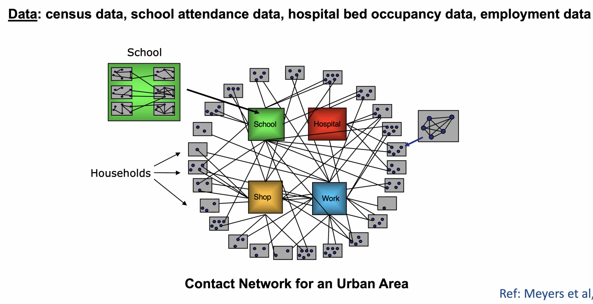
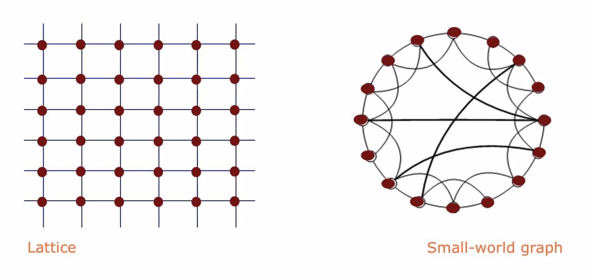
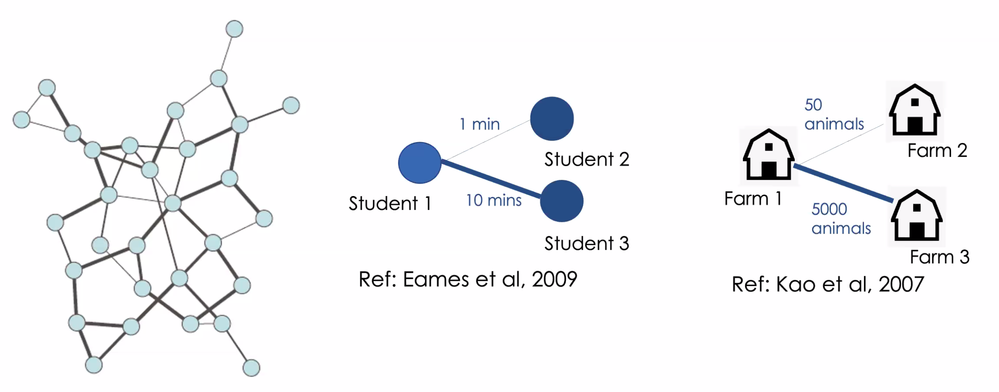
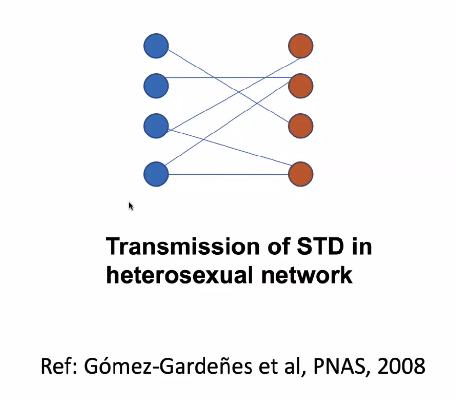
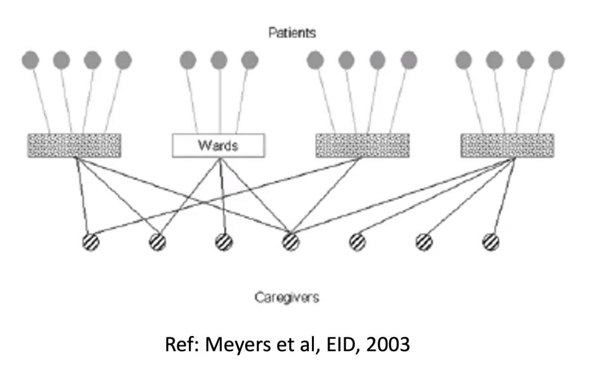
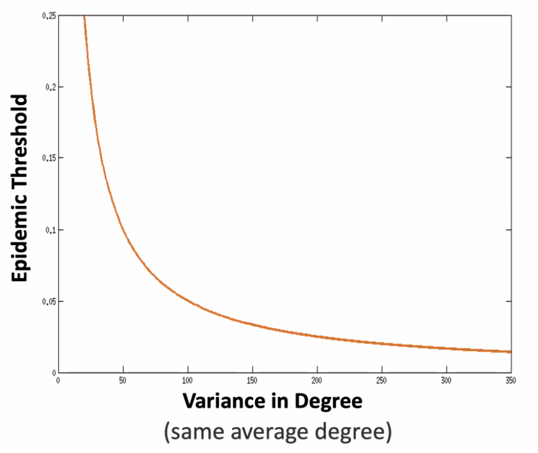

# Introduction 

- Networks used to capture host population contact heterogeneity and structure
- Process of building a contact network model
  - Define a realistic contact network
  - Predict the spread of disease through the network
  - Apply understanding of network structure and disease spread for public
    health questions

- Issues with traditional compartmental models:
  - Assumes homogeneous mixing ($\beta$)
    - Know this is not true

- Basic description of a contact network model
  - Individual nodes connected through edges (contacts)
  - Degree = number of edges 
  - Are specific to a population and disease class
    - Different disease transmit via different methods in different populations!

- Contacts:
  - Summarizes
    - Potential for individual to infect others
    - Potential vulnerability

# Defining a realistic contact network

- How to define a contact network (in decreasing realism)
  - Empirical networks
    - Based on data from population
    - Not feasible for large populations
  - Heuristic networks
    - Tries to merge other two types
    - 
  - Idealized networks
    - Networks that are computationally generated/mathematically described
    - Depend on small pieces of information from data to generate
    - Fast as well described
    - 
      - Lattice may capture spatial structure
      - Small world when most interactions with nearby individuals
    - Also includes random networks

## Adding more information in contact networks

- Network across scales
  - Think about network where node represents location, not individuals
    - E.g. livestock movement

- Weighted contacts
  - Instead of edge being binary, can be weighted edge/contact
    - Represent strength of contact between individuals
    - 

- Directed edges
  - Represent asymmetry in contact
  - Note always the best way to represent but sometimes useful e.g. city dweller
    to healthcare worker

- Bipartite network
  - Only transmission between certain nodes
  - 

- Co-location network
  - 

# Predict the spread of a disease through the network

- Network itself contains lots of information about how the disease will spread
- Degree distribution
  - Larger variance in degree decreases the epidemic threshold
  - 

- Network transitivity
  - Property that measures the propensity of triangles
  - Transitivity makes populations hard to invade and leads to smaller and
    longer epidemics

- Dynamic network
  - Contact networks are static in reality, so sometimes want to change
    throughout the model